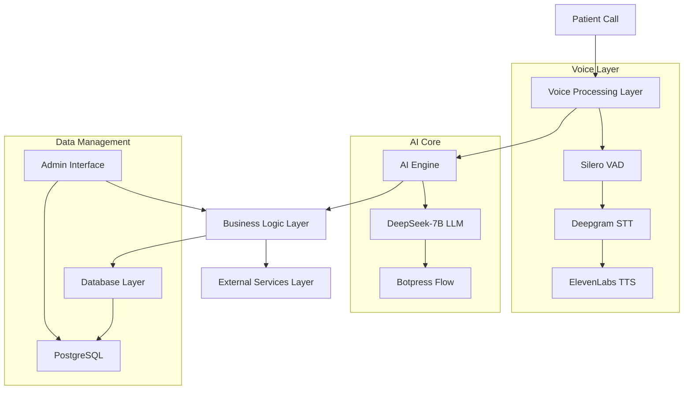

# AI Voice Agent System Context - MVP

## 1. System Overview

### 1.1 Purpose & System Overview

#### Core Purpose
The AI Voice Agent is an intelligent phone-based system that enables patients to schedule, modify, and cancel appointments at a medical facility through natural voice conversations. The system will be built with a focus on delivering a human-like experience, making it difficult for callers to distinguish between the AI agent and a real person.

For the MVP, the system will be developed and tested for a single medical facility. Multi-facility support will be added in a later phase.

#### System Behavior & Capabilities

**1. Inbound Call Handling**
- Answers incoming calls with natural voice interaction (ElevenLabs)
- Recognizes patient speech in real-time (Deepgram + Silero VAD)  
- Identifies existing patients through phone number
- Accesses patient records directly from eClinicalWorks EHR
- Handles appointment scheduling, modifications, and cancellations
- Provides facility information and answers common questions

**2. Outbound Services**  
- Makes automated reminder calls before appointments
- Follows up for appointment confirmations

**3. Patient Experience**
- Natural, human-like conversation flow
- Personalized interactions based on patient history  
- Flexible scheduling options

**4. Clinical Integration**
- Direct eClinicalWorks EHR integration
- Real-time calendar/schedule access
- Provider availability checking
- Patient record access and updates

**5. Administrative Features** 
- Staff dashboard for monitoring calls
- Real-time appointment calendar
- Patient interaction history

**6. Intelligence & Learning**
- DeepSeek-7B LLM for understanding and responses
- Continuous learning from interactions
- Context-aware conversations  
- Handling of complex scheduling scenarios

**7. Integration Capabilities**
- EHR system integration (eClinicalWorks)
- Calendar synchronization  
- Transportation services (Uber)
- SMS notifications (Twilio)

### 1.2 Core Architecture Components & Integration

#### 1.2.1 System Architecture Overview


#### 1.2.2 Component Communication & Integration

1. **Voice Processing Layer**
- Real-time WebSocket streaming
- Parallel processing for voice activity and transcription
- Bi-directional audio transformation

2. **AI Engine Core**  
- Context management and state tracking
- Intent recognition and entity extraction 
- Dynamic response generation

3. **Business Logic Layer**
- Appointment workflow orchestration
- Patient data management
- Service integration coordination

4. **Data Management Layer** 
- PostgreSQL data storage
- Retool admin interface integration

## 2. Database Schema

### 2.1 Core Tables

1. **Patients**
```sql
CREATE TABLE patients (
    id UUID DEFAULT gen_random_uuid() PRIMARY KEY,
    name VARCHAR(100) NOT NULL,
    phone VARCHAR(20) NOT NULL,
    email VARCHAR(100),
    date_of_birth DATE NOT NULL,
    demographics JSONB,
    emergency_contact JSONB,
    preferences JSONB,
    created_at TIMESTAMPTZ DEFAULT NOW(),
    updated_at TIMESTAMPTZ
);
```

2. **Providers**
```sql  
CREATE TABLE providers (
    id UUID DEFAULT gen_random_uuid() PRIMARY KEY,
    name VARCHAR(100) NOT NULL,  
    speciality VARCHAR(100) NOT NULL,
    credentials JSONB NOT NULL,
    contact_info JSONB NOT NULL,
    status VARCHAR(20) DEFAULT 'active',
    created_at TIMESTAMPTZ DEFAULT NOW(),
    updated_at TIMESTAMPTZ
);
```

3. **Appointments**
```sql
CREATE TABLE appointments (
    id UUID DEFAULT gen_random_uuid() PRIMARY KEY,
    patient_id UUID NOT NULL REFERENCES patients(id),
    provider_id UUID NOT NULL REFERENCES providers(id),
    schedule TIMESTAMPTZ NOT NULL,
    appointment_type VARCHAR(50) NOT NULL,
    status VARCHAR(20) NOT NULL DEFAULT 'scheduled',
    notes TEXT,
    transportation_needed BOOLEAN DEFAULT false,
    uber_ride_id VARCHAR(50),
    created_at TIMESTAMPTZ DEFAULT NOW(),
    updated_at TIMESTAMPTZ,
    CONSTRAINT valid_appointment_status CHECK (
        status IN ('scheduled', 'confirmed', 'completed', 'cancelled', 'no_show')
    )
);

CREATE INDEX idx_appointments_patient_phone ON appointments(patient_id, schedule);

```

4. **Call Logs**
```sql
CREATE TABLE call_logs (
    id UUID DEFAULT gen_random_uuid() PRIMARY KEY,
    call_id VARCHAR(50) NOT NULL UNIQUE,
    phone_number VARCHAR(20) NOT NULL,
    direction VARCHAR(10) NOT NULL,  
    status VARCHAR(20) NOT NULL,
    duration INTEGER,
    transcript TEXT,  
    recording_url TEXT,
    created_at TIMESTAMPTZ DEFAULT NOW()
);
```

5. **Call States**
```sql
CREATE TABLE call_states (
    id UUID DEFAULT gen_random_uuid() PRIMARY KEY,
    call_id VARCHAR(50) NOT NULL UNIQUE,
    current_state VARCHAR(50) NOT NULL,
    context_data JSONB NOT NULL,
    created_at TIMESTAMPTZ DEFAULT NOW(),
    CONSTRAINT valid_call_state CHECK (
        current_state IN ('greeting', 'verification', 'scheduling', 'confirmation', 'completed')
    )
);

CREATE INDEX idx_call_states_call_id ON call_states(call_id);
```

6. **Appointment History**
```sql
CREATE TABLE appointment_history (
    id UUID DEFAULT gen_random_uuid() PRIMARY KEY,
    appointment_id UUID NOT NULL REFERENCES appointments(id),
    status_from VARCHAR(20) NOT NULL,
    status_to VARCHAR(20) NOT NULL,
    notes TEXT,
    created_at TIMESTAMPTZ DEFAULT NOW(),
    CONSTRAINT valid_status_transition CHECK (
        status_from IN ('scheduled', 'confirmed', 'completed', 'cancelled', 'no_show') AND
        status_to IN ('scheduled', 'confirmed', 'completed', 'cancelled', 'no_show')
    )
);

CREATE INDEX idx_appointment_history_appointment ON appointment_history(appointment_id);
```

### 2.2 JSONB Structure Examples

1. **Patient Demographics**
```json
{
  "gender": "F",
  "language": {
    "primary": "en",
    "secondary": "es"  
  },
  "ethnicity": "hispanic",
  "race": "white",
  "insurance": {
    "provider": "Blue Cross",
    "id": "BC123456"
  }
}
```
2. **Patient Preferences**  
```json
{
  "appointment_reminders": {
    "methods": ["sms", "email"],
    "advance_notice": "24h"
  },
  "notifications": {
    "lab_results": "phone",
    "prescription_refills": "email"
  },
  "communication": {
    "preferred_language": "en"
  },
  "transportation": {
    "needs_transport": true,  
    "service": "uber"
  }
}
```

3. **Provider Credentials**
```json
{
  "license": {
    "number": "MD123456",
    "state": "TX",
    "expiry": "2025-12-31"  
  },
  "specializations": [
    {
      "name": "Orthopedic Surgery",
      "certification": "American Board of Orthopedic Surgery"
    }
  ],
  "education": [
    {
      "degree": "MD",  
      "institution": "Harvard Medical School",
      "year": 2010
    }
  ]
}
```
4. **Call States Context**
```json
{
  "conversation_state": "scheduling",
  "patient_verified": true,
  "collected_info": {
    "appointment_type": "follow_up",
    "preferred_time": "morning",
    "preferred_days": ["monday", "wednesday"]
  },
  "last_intent": "schedule_appointment",
  "entities": {
    "date": "2024-02-10",
    "time": "10:00",
    "doctor": "Dr. Smith"
  }
}
```

## 3. API Endpoints

### 3.1 Voice Processing
- `POST /voice/stream`: Handles real-time voice streaming
- `GET /voice/status`: Returns the current status of the voice processing system

### 3.2 Appointment Management  
- `POST /appointments`: Creates a new appointment
- `GET /appointments/{id}`: Retrieves an appointment by ID
- `PUT /appointments/{id}`: Updates an existing appointment
- `DELETE /appointments/{id}`: Cancels an appointment

### 3.3 Patient Management
- `GET /patients/{id}`: Retrieves a patient by ID
- `POST /patients`: Creates a new patient record
- `PUT /patients/{id}`: Updates an existing patient record

### 3.4 Provider Management
- `GET /providers`: Retrieves a list of providers
- `GET /providers/{id}`: Retrieves a provider by ID  
- `GET /providers/{id}/availability`: Checks a provider's availability for a given date/time

### 3.5 Voice Processing:
- `POST /voice/end`: End call and cleanup resources

### 3.6 Appointment Management:
- `POST /appointments/verify`: Verify slot availability before booking

### 3.7 Call Management:
- `GET /calls/active`: Get currently active calls
- `PUT /calls/{id}/state`: Update call state

## 4. External Integrations

### 4.1 eClinicalWorks EHR
- Bidirectional sync of patient data
- Real-time appointment scheduling and updates
- Provider availability checks

### 4.2 Uber  
- Booking transportation for patients
- Ride status tracking
- Integration with appointment reminders

### 4.3 Twilio
- SMS appointment reminders
- Automated voice calls for confirmations
- Call recording and transcription

### 4.4 Weather API  
- Fetching weather data for appointment dates
- Generating weather alerts and advisories

## 5. Future Enhancements (Post-MVP)
1. Multi-facility support
2. Advanced scheduling features (e.g., recurring appointments)
3. Multilingual support
4. Sentiment analysis  
5. Enhanced training pipeline with PEFT and quantization
6. Advanced monitoring and logging with MLflow and Datadog
7. Patient portal integration
8. Billing and insurance verification
9. Prescription refill handling  
10. Intelligent appointment recommendations

## 6. Development Plan

### Phase 1: Voice Processing (2 weeks)
- Deepgram STT integration
- ElevenLabs TTS setup
- Twilio call handling
- WebSocket implementation

### Phase 2: Database & Admin (2 weeks)
- PostgreSQL implementation
- Core tables creation
- Retool admin interface:
  * CRUD for patients, providers, appointments
  * Call logs viewer
  * Basic dashboard

### Phase 3: Conversation Logic (2 weeks)
- DeepSeek-7B LLM integration
- Botpress flow setup
- Appointment scheduling flow
- Call state management

### Phase 4: Testing & Refinement (1 week)
- End-to-end testing
- Load testing
- Security implementation

### Phase 5: Deployment (1 week)
- Production setup
- Monitoring implementation
- Documentation
- Staff training